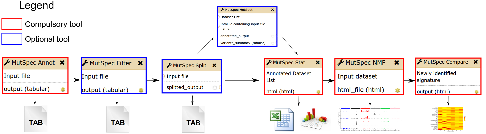

# MutSpec: mutation spectra analysis tool suite

- [Description](https://github.com/IARC-bioinfo/mutspec#Description)
- [Overview of MutSpec tools and workflow](https://github.com/IARC-bioinfo/mutspec#Overview of MutSpec tools and workflow)
- [Prerequisites](https://github.com/IARC-bioinfo/mutspec#Prerequisites)
- [Annovar installation](https://github.com/IARC-bioinfo/mutspec#Annovar installation)
- [MutSpec usage](https://github.com/IARC-bioinfo/mutspec#MutSpec usage)
	- [MutSpec-Annot](https://github.com/IARC-bioinfo/mutspec#MutSpec-Annot)
	- [MutSpec-Filter](https://github.com/IARC-bioinfo/mutspec#MutSpec-Filter)
	- [MutSpec-Split](https://github.com/IARC-bioinfo/mutspec#MutSpec-Split)
	- [MutSpec-Hotspot](https://github.com/IARC-bioinfo/mutspec#MutSpec-Hotspot)
	- [MutSpec-Stat](https://github.com/IARC-bioinfo/mutspec#MutSpec-Stat)
	- [MutSpec-NMF](https://github.com/IARC-bioinfo/mutspec#MutSpec-NMF)
	- [MutSpec-Compare](https://github.com/IARC-bioinfo/mutspec#MutSpec-Compare)
- [Download test data](https://github.com/IARC-bioinfo/mutspec#Download test data)
- [Galaxy installation](https://github.com/IARC-bioinfo/mutspec#Galaxy installation)
- [Authors](https://github.com/IARC-bioinfo/mutspec#Authors)
- [Citation](https://github.com/IARC-bioinfo/mutspec#Citation)
- [License](https://github.com/IARC-bioinfo/mutspec#License)

## Description

MutSpec includes a suite of tools for analysing and interpreting mutational signatures from next-generation sequencing technologies from human tumours and experimental systems.

MutSpec tools are designed to:
- Annotate genome variations (MutSpec-Annot).
- Filter known polymorphisms and user-defined regions (MutSpec-Filter).
- Split list of variants by sample ID (MutSpec-Split).
- Compute variant frequency on a dataset (MutSpec-HotSpot).
- Compute various statistics describing mutation spectra features (MutSpec-Stat).
- Extract mutational signatures defined by the six types of single base substitutions (SBS) in their trinucleotide sequence context (MutSpec-NMF).
- Compare the obtained signatures with published ones (MutSpec-Compare).

The tools work in a logical sequence, using as input the outputs of each preceding tool, and were developed for human, mouse and rat genomes.

The different tools can be run using command lines and are also available on Galaxy.


## Overview of MutSpec tools and workflow




## Prerequisites

### Build sofwares
```bash
sudo apt-get install build-essential
```

### Build Python modules
```bash
sudo apt-get install python-dev
```

### Perl (>= v5.18.1)
```bash
sudo apt-get install perl
```
- Perl modules:  
[Parallel::ForkManager](http://search.cpan.org/~dlux/Parallel-ForkManager-0.7.5/ForkManager.pm) (>= v0.7.5)  
[Math::Round](http://search.cpan.org/dist/Math-Round/Round.pm) (>= v0.06)  
[Spreadsheet::WriteExcel](http://search.cpan.org/~jmcnamara/Spreadsheet-WriteExcel-2.40/lib/Spreadsheet/WriteExcel.pm) (v2.40)  

These modules can be installed through [CPAN](http://www.cpan.org/)

```bash
sudo apt-get install cpan
cpan
nolock_cpan[1]> install Module::Name
```

### R (>= v3.1.2)  
```bash
sudo apt-get install r-base r-base-dev
```

- R packages  
[getopt](https://cran.r-project.org/web/packages/getopt/index.html) (v1.20.0)  
[lsa](https://cran.r-project.org/web/packages/lsa/index.html) (v0.73.1)  
[ggplot2](https://cran.r-project.org/web/packages/ggplot2/index.html) (v1.0.1)  
[reshape](https://cran.r-project.org/web/packages/reshape/index.html) (>= v0.8.5)  
[NMF](https://cran.r-project.org/web/packages/NMF/index.html) (v0.20.6)  
[gplots](https://cran.r-project.org/web/packages/gplots/index.html) (>= 2.17.0)  
[gtable](https://cran.r-project.org/web/packages/gtable/index.html) (>= v0.1.2)  
[scales](https://cran.r-project.org/web/packages/scales/index.html) (>= 0.2.5)  
[gridExtra](https://cran.r-project.org/web/packages/gridExtra/index.html) (0.9.1)  
 

These packages can be installed in R:  

```R
install.packages(https://cran.r-project.org/src/contrib/package_1.1.tar.gz, repos=NULL, type="source")
```

### WebLogo3 (>= v3.3)

```bash
sudo pip install weblogo
```

### Annovar (>= 2016Feb01)

The latest release can be downloaded at http://www.openbioinformatics.org/annovar/annovar_download_form.php after free registration.

## Annovar installation

1. Unpack the package and add ANNOVAR into your system executable path
	```bash
	tar xvfz annovar.latest.tar.gz
	export PATH="/dir/annovar/:$PATH"
	```

2. First you need to create directories for saving Annovar databases files used for the annotation:
	- Create a folder (genomedb) for saving all Annovar databases, e.g. hg19db
	- Create a subfolder (seqFolder) for saving the reference genome, e.g. hg19db/hg19_seq

3. Download the reference genome (by chromosomes) from UCSC for all desired builds as follows:

	```perl
	annotate_variation.pl -buildver <build> -downdb seq <seqFolder>
	```

	`build` is your prefered reference genome  
	`seqFolder` is the location where the sequences (by chromosmes) should be stored, e.g. hg19db/hg19_seq

4. Download all desired databases for your builds. **At least the database refGene must be downloaded.**  

	```perl
	annotate_variation.pl -buildver <build> -webfrom annovar -downdb <database> <genomedb>
	```
	`build` is your prefered reference genome  
	`database` is the name of database file to download, e.g. refGene  
	`genomedb` is the location where all database files should be stored, e.g. hg19db  

	The list of available Annovar databases can be found here: http://annovar.openbioinformatics.org/en/latest/user-guide/download/


5. Edit the file build_listAVDB.txt present in mutspec folder to reflect the name and the type of the databases you have installed


## MutSpec usage

To install MutSpec scripts, clone the github repository.

```bash
https://github.com/IARCbioinfo/mutspec.git
```

Then run the different scripts from mutspec folder.

### MutSpec-Annot

Provides functional annotations from [ANNOVAR](http://annovar.openbioinformatics.org/en/latest/) software, as well as the strand transcript orientation (from refGene database) and the sequence context of variants (extrated from the reference genome selected).

#### Input format

VCF(s) (version 4.1 and 4.2) or tab-delimited text file from various variant callers.

Filenames must be &#60;= 31 characters and should not contains "." in their suffix.

Files should contain at least four columns describing for each variant: the chromosome number, the start genomic position, the reference allele and the alternate alleles. These columns can be in any order.

If multiple input files are specified as input for the tool, they should be from the **same genome build** and in the **same format**.

The tool supports different column names (**names are case-sensitive**) depending on the source file as follows:

- `mutect`:     contig position ref_allele alt_allele

- `vcf`:        version [4.1](https://samtools.github.io/hts-specs/VCFv4.1.pdf) and [4.2](https://samtools.github.io/hts-specs/VCFv4.2.pdf)

- `cosmic`:     Mutation_GRCh37_chromosome_number Mutation_GRCh37_genome_position Description_Ref_Genomic Description_Alt_Genomic

- `icgc`:       chromosome chromosome_start reference_genome_allele mutated_to_allele

- `tcga`:       Chromosome Start_position Reference_Allele Tumor_Seq_Allele2

- `ionTorrent`: chr Position Ref Alt            

- `proton`:     Chrom Position Ref Variant        

- `varScan2`:   Chrom Position Ref VarAllele

- `varScan2 somatic`:   chrom position ref var

- `annovar`:    Chr Start Ref Obs                 

- `custom`:     Chromosome Start Wild_Type Mutant


For MuTect and MuTect2 output files, only confident calls are considered as other calls are very likely to be dubious calls or artefacts.
Variants containing the string REJECT in the judgement column or not passing MuTect2 filters are not annotated and excluded from MutSpect-Annot output. 

For COSMIC and ICGC files, variants are reported on several transcripts. These duplicate variants need to be remove before annotated the file.


#### Output

The output is a tabular text file containing the retrieved annotations in the first columns and all columns from the original file at the end.

Only classic chromosomes are considered for the annotation, all other chromosomes are excluded from MutSpec-Annot output.
For example for human genome only chr1 to chrY are annotated.


The minimum annotations retrieved are:

- Gene-based: RefSeqGene

- Transcript orientation

The strand annotation corresponding to transcript orientation within genic regions is recovered from RefSeqGene database.

- Sequence context

Flanking bases in both sides in 5' and 3' of the variant position are retrieved from the reference genome used.


#### Usage

```perl
perl mutspecAnnot.pl --refGenome hg19 --pathAnnovarDB path/hg19db --pathAVDBList mutspec/hg19_listAVDB.txt input
```

`--refGenome`, `--pathAnnovarDB`, `--pathAVDBList` and `input` are compulsory.  

List of parameters with default values:

| Parameter         | Default value                        | Description          |
|-------------------|--------------------------------------|----------------------|
| --refGenome       |                                      | Name of the reference genome |
| --pathAnnovarDB   |                                      | Path to annovar databases files |
| --pathAVDBList    |                                      | Path to build_listAVDB.txt |
| input             |                                      | Input folder or input file |
| --interval        | 10                                   | Number of bases to retrieve for the sequence context |     
| --outfile         | input directory                      | Output directory |
| --temp            | directory in which the script is run | Path for saving temporary files |
| --fullAnnotation  | yes                                  | Recover all Annovar annotations specified in build_listAVDB.txt |
| --max_cpu         | 8                                    | Number of CPUs to be used for the annotation |


##### Recommendation for setting the parameters:

- --fullAnnotation

Set this parameter to "no" if your analysis includes millions of variants and you are just interested in having a quick overview of the mutation spectrum. Only the annotations needed for the tool [MutSpec-Stat](https://github.com/IARC-bioinfo/mutspec#MutSpec-Stat) will be added (annotation from refGene, the strand orientation and the sequence context).

- --max_cpu

Annotated large files may be time consuming. For example, annotating a file of more than 25,000 variants takes 1 hour using 1 CPU (2.6 GHz),
while annotating this file using 8 CPUs takes only 5 minutes.  

Recommanded number of CPUs to use:  
-files with less than 5,000 lines: 1 CPU  
-files with more than 5,000 and less than 25,000 lines: 2 CPUs  
-files with more than 25,000 and less than 100,000 lines: 8 CPUs (our benchmark
results didn't show any time saving using more than 8 CPUs for files with more than 25,000 but less than 100,000 lines)  
-files with more than 100,000: maximum CPUs available on your machine


### MutSpec-Filter (optional)

Filter out variants that are likely neutral polymorphisms using Annovar annotations (dbSNP, ESP...) or additional databases in [VCF](https://samtools.github.io/hts-specs/VCFv4.2.pdf) or [BED](https://genome.ucsc.edu/FAQ/FAQformat#format1) format.  

#### Input format

Tab delimited text files generated by [MutSpec-Annot](https://github.com/IARC-bioinfo/mutspec#MutSpec-Annot).

#### Output

Tab delimited text file filtered for variants considered as neutral polymorphisms.

#### Usage

```perl
perl mutspecFilter.pl --thG --refGenome hg19 --pathAVDBList mutspec/hg19_listAVDB.txt --outfile output_filename input_folder
```

List of parameters:

| Parameter | Default value | Description          |
|-----------|---------------|----------------------|
| --dbSNP   | 0             | Column number for dbSNP (start to count from 1) |
| --segDup  | false         | Remove variants present at >= 0.9 frequency in the genomic duplicate segments database |
| --esp     | false         | Remove variants present at frequency > 0.001 in the Exome Sequencing Project database **(only valid for human genomes)** |
| --thG     | false         | Remove variants present at frequency > 0.001 in the 1000 genome database **(only valid for human genomes)** |
| --exac    | false         | Remove variants present at frequency > 0.001 in the EXome Agregate Consortium database **(only valid for human genomes)** |
| --filter  |  				| Path to VCFs or BED files to filter against |
| input     |  				| Input folder or input file |
| --outfile |  				| Output file |


### MutSpec-Split (optional)

Split list of variants by sample ID.  
**This tool need to be used if you have a single file containing all your samples.**

#### Input format

A tab delimited text file.

#### Output

A folder containing tab delimited text files for each samples present in the input file.

#### Usage

** A COMPLETER **


### MutSpec-Hotspot (optional)

** A COMPLETER **

#### Input format


#### Output


#### Usage


### MutSpec-Stat

Calculate statistics on mutation features for each individual samples as well as on the sample pool.

The statistics calculated include:
- Counts and distributions of overall mutation types (SBS and indels)
- Distribution of SBS by functional regions (based on RefSeq annotations)
- Distribution of SBS by chromosomes
- Counts and distributions of SBS in their trinucleotide sequence context (96 mutation types), calculated on the genome sequence or only on transcribed sequences (stranded analysis).


#### Input format

A folder with tab delimited text files (one file per sample) generated by [MutSpec-Annot](https://github.com/IARC-bioinfo/mutspec#MutSpec-Annot).


#### Output

- Excel file that includes all computed statistics shown in tabular and graphical formats, for each sample (one by datasheet) and for the pooled samples (optional).  
- A folder containing all the figures and tables by sample.  
- Input matrix for the tool [MutSpec-NMF](https://github.com/IARC-bioinfo/mutspec#MutSpec-NMF).

The following statistics are generated and summarised in the Excel file:

`Graph 1. SBS distribution` Proportion (percent of all SBS) of each type of single base substitution (SBS). All SBS are considered, including the ones without strand orientation annotation.

`Table 1. Frequency and counts of all SBS` Values corresponding to graph 1.

`Graph 2. Impact on protein sequence` Impact of all mutations (SBS and Indel) on the protein sequence based on the ExonicFunc.refGene annotation. For more details about the annotation, please visit the [Annovar web page](http://annovar.openbioinformatics.org/en/latest/user-guide/gene/#output1).

`Table 2. Frequency and counts of functional impacts` Values corresponding to graph 2.

`Graph 3. Stranded distribution of SBS` Proportion (percent of all SBS with strand annotation) of the six substitution types on the transcribed and non-transcribed strand. Only regions with strand annotation are considered.

`Table 3. Significance of the strand biases` The strand bias for each SBS type is calculated as the ratio of SBS on the non-transcribed (coding) versus the transcribed (non-coding) strand. The statistical significance of the differences between the mutational frequencies on the non-transcribed and the transcribed strand (equal to 0.5, as expected by chance) is assessed using a chi-squared test followed by the Benjamini- Hochberg procedure for multiple testing corrections (only samples with at least 1 mutations on the non-transcribed or on the transcribed strand are considered). Two tables are shown in the Excel report to display the 6 SBS types in both orientations.

`Table 4. SBS distribution by functional region` Count and percentages of SBS in genomic regions based on the Func.refGene annotation.

`Table 5. Strand bias by functional region` Counts of the strand bias for the 6 SBS types in different functional regions.

`Table 6. SBS distribution per chromosome` Counts of SBS per chromosome for the six SBS types. The correlation between SBS counts and chromosome size is calculated using a Pearson correlation test.

`Panel 1. Trinucleotide sequence context of SBS on the genomic sequence` The trinucleotide sequence context takes into consideration the flanking base in 5' and in 3' of the SBS. SBS counts and frequency data are shown as tables, heatmaps or bar graphs. The heatmap colors are scaled to the maximum value of the corresponding table. The bar graph is scaled to the maximum frequency value (total number of mutation by SBS type is shown in parenthesis).

`Panel 2. Stranded analysis of trinucleotide sequence context of SBS` SBS within their trinucleotide sequence context are counted on the non-transcribed and transcribed strands of the gene region they are located in. Counts and frequencies are shown as tables or bar graphs. Only SBS with strand orientation annotation are considered in this analysis (strand annotation retrieved from RefSeq database).


#### Usage

```perl
perl mutspecStat.pl --refGenome hg19 --pathRscript mutspec/ --pathSeqRefGenome dir/hg19db/ input_folder
```

`--refGenome`, `--pathRscript`, `--pathSeqRefGenome` and `input_folder` are compulsory.  

List of parameters with default values:

| Parameter          | Default value                        | Description          |
|--------------------|--------------------------------------|----------------------|
| --refGenome        |                                      | Name of the reference genome |
| --pathRscript      |                                      | Path to mutspec R scripts |
| --pathSeqRefGenome |                                      | Path to reference genome fasta files (one per chromosomes) |
| input_folder       |                                      | Input folder |
| --outfile          | input directory                      | Output directory |
| --temp             | directory in which the script is run | Path for saving temporary files |
| --poolData         | false                                | Calculate statistics on the sample pool |
| --reportSample     | false                                | Generate an Excel report for each sample |


By default, one output Excel file will be generated with statistics of each sample shown in different datasheets.  
Adding the option `--reportSample` will generate one Excel file for each sample instead. It is recommended to use this option if you are analysing more than 250 samples as the Excel output file may be too heavy to open easily on a computer with limited RAM.


### MutSpec-NMF

Extract mutational signatures composed of 96 SBS types (6 SBS types in their trinucleotide sequence context) using the non-negative matrix ([NMF](http://www.nature.com/nature/journal/v401/n6755/full/401788a0.html)) factorisation algorithm of Brunet with the Kullback-Leibler divergence penalty implemented in the [R package NMF](http://www.biomedcentral.com/1471-2105/11/367).

#### Input format

Input matrix created with the tool [MutSpec-Stat](https://github.com/IARC-bioinfo/mutspec#MutSpec-Stat).

#### Output

- Composition of mutational signatures and contribution of each signature to each sample.
- Input matrix for the tool [MutSpec-Compare](https://github.com/IARC-bioinfo/mutspec#MutSpec-Compare)


#### Usage

```R
Rscript R/somaticSignature_Galaxy.r --input outfile_MutSpec-Stat/Mutational_Analysis/Figures/Input_NMF/Input_NMF_Count.txt --nbSignature 2 --cpu 8 --output output_dir
```

List of parameters:

| Parameter          | Description          |
|--------------------|----------------------|
| --input            | Input matrix created with the tool MutSpec-Stat |
| --nbSignature      | Number of signatures to extract |
| --cpu              | Number of CPUs |
| --output           | Output directory |
| --html             | Path to HTML page (ONLY FOR GALAXY WRAPPER) |


### MutSpec-Compare

Computes the similarity between the signatures identified by MutSpec-NMF and a set of published signatures using the cosine similarity method.

#### Input format

- A matrix containing the signatures identified by MutSpec-NMF.  
- A matrix containing a set of published signatures.  

Two set of published signatures are provided:
- `Frequency-COSMICv72-Hupki.txt`: Contains the 30 mutational signatures operative in human cancer from [COSMIC](http://cancer.sanger.ac.uk/cosmic/signatures) and 4 experimental signatures obtained in mouse cells for AA, MNNG, BaP and AID published by [Olivier et al.](http://www.nature.com/articles/srep04482)
- `Frequency-COSMICv72-Hupki-Others.txt`: Contains in addition experimental signatures obtained in mouse model for DMBA published by [Nassar et al.](http://www.nature.com/nm/journal/v21/n8/full/nm.3878.html), MNU and Urethane published by [Westcott et al.](http://www.nature.com/nature/journal/v517/n7535/full/nature13898.html).

#### Output

Heatmap showing the cosine similarity between the signatures identified by MutSpec-NMF and a set of published signatures.


#### Usage

```R
Rscript R/compareSignature_Galaxy.r Frequency-COSMICv72-Hupki.txt output_dir_MutSpec-NMF/NMF/Files/MatrixW-Inputggplot2.txt output_dir_MutSpec-NMF/NMF/
```

List of parameters:

| Parameter           | Description          |
|---------------------|----------------------|
| Published_Signature | Matrix containing a set of published signatures |
| New_Signature       | Matrix containing the signatures identified by MutSpec-NMF |
| Output_Folder       | Output directory |


## Download test data

The data and the workflow used in [MutSpec publicaton](http://bmcbioinformatics.biomedcentral.com/articles/10.1186/s12859-016-1011-z) are available at 
https://usegalaxy.org/u/maude-ardin/p/mutspectestdata


## Galaxy installation

A package name **mutspec** is available on [Galaxy toolshed](https://toolshed.g2.bx.psu.edu/).


** A COMPLETER **


## Authors

Ardin Maude, Cahais Vincent and Robitaille Alexis.

## Citation

Ardin M, Cahais V, Castells X, Bouaoun L, Byrnes G, Herceg Z, Zavadil J and Olivier M (2016). "MutSpec: a Galaxy toolbox for streamlined analyses of somatic mutation spectra in human and mouse cancer genomes." BMC Bioinformatics. [doi: 10.1186/s12859-016-1011-z](http://bmcbioinformatics.biomedcentral.com/articles/10.1186/s12859-016-1011-z).

## License

GNU public license version 2 (GPL v2)
